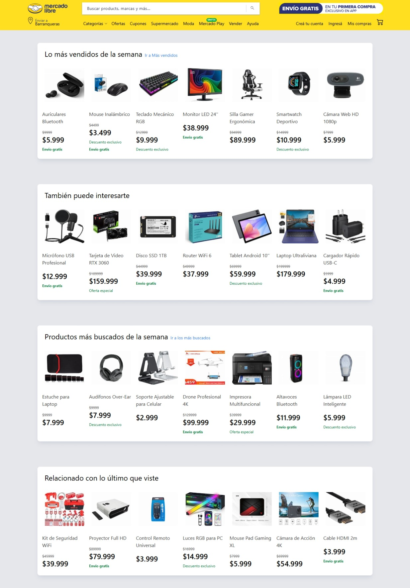

# 🌐 **Entrega-4 - Informatorio 2025**  

Este repositorio contiene lo solicitado para la **Entrega-3** en la especialidad de **React** del Informatorio 2025.  

## 📝 **Descripción**  
Para el proyecto se utilizó **Vite + React + TypeScript**, simulando parte del sitio de **Mercado Libre Argentina**.  

### 📌 **Características Etapa 1**  
✔ Implementación de un **Navbar** en el **Header**.  
✔ Renderizado de **artículos** en el **Main**, cumpliendo con los requerimientos solicitados.  
✔ Uso de **children** para la composición de componentes.  
✔ Estilos con **Tailwind**, asegurando una estructura visual ordenada.  

---

### 📌 **Características Etapa 2**  
✔ Buscador de productos. **Filtrado los productos** por nombre a medida que el usuario escribe.
✔ Selector de filtros. Filtrado por categoría, precio, etc.
✔ Opcion de agregar al carrito desde cada producto. Cada card tiene un botón "Agregar". Al hacer click, suma al contador del carrito en el header.
✔ Opcion de quitar del carrito desde cada producto. Cada productor agregado tiene un botón de "Quitar", un **contador de producto individual** . Al hacer click, resta al contador del carrito en el header.
✔ Carrito en el header. Ícono con **contador visible** del total de productos.

---
### 📌 **Características Etapa 3**  

 🛒 Ecommerce (Mercado Libre)
 ✅
 Rutas obligatorias:
   /  Lista de productos
   /producto/:id  Detalle de producto
   /carrito  Carrito de compras
   /checkout  Simulación de compra
   Agregar page de 404

---
### 📌 **Características Etapa 4**  

🛒 Ecommerce (Mercado Libre)
 ✅ Obtener lista de productos desde servicio
 ✅ Obtener detalle del producto (/producto/:id ) desde servicio
 ✅ Agregar al carrito no necesita servicio (mantener el manejo de estado actual)
 ✅ Mostrar estado de carga/error mientras se obtienen datos
 ✅ Crear ruta nueva que permite crear productos usando hook

 
---
## 🛠️ **Requerimientos Técnicos**  

| 💻 Tecnología | ⚙️ Requerimiento |
|--------------|----------------|
| **Framework** | Vite + React + TypeScript |
| **Listados** | Cuatro listados cada uno con siete ítems mockeados |
| **Componentes** | UI simple de Mercado Libre con componentes reutilizables |
| **Tipado** | TypeScript |
| **Estilos** | Tailwind |

---

## 🌟 **Vista Final del Proyecto**  
Aquí puedes ver la interfaz final inspirada en Mercado Libre Argentina:  

  

---

## 🏗️ **Estructura del Proyecto**  
```bash

```

##  📦 **Instalación y Uso
1️⃣ Clonar el repositorio:

  ```bash
      git clone <URL_DEL_REPOSITORIO>
      cd <NOMBRE_DEL_REPOSITORIO>
  ```
2️⃣ Instalar dependencias:

  ```bash
    npm install
  ```
3️⃣ Ejecutar el proyecto:

  ```bash
    npm run dev
  ```
